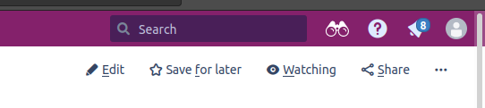
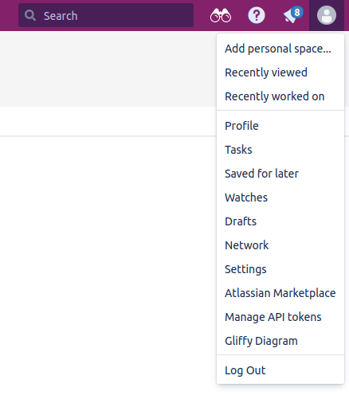
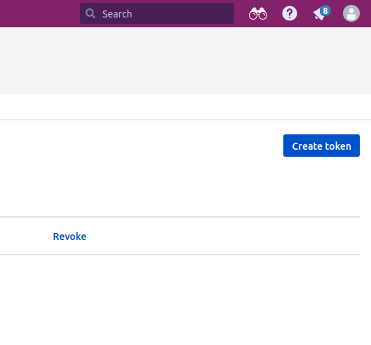

# POC Markdown2Confluence

Are you tired of updating confluence, after updating the readme in your project?  
Or are you forced to write documentation in confluence, but want to write it in the readme-file in the project?  

Lets automate that...  

This is a project for deploying Markdown, aka your readme-file, to Confluence.  
It can be done from your local machine with Make, shell-script or 
from a pipeline in Gitlab. 

This makes it possible to automaticly update confluence in your CI/CD-pipeline after you have updated documentation in your Readme, saving that stupid copy-pasting-step if your business needs you to update confluence.  

## How to use?  

```shell
TOKEN=xxxxxxxxxxxxxxx make confluence  
```

## How to migrate to other projects with Makefile?  

1. Copy-paste the confluence-step __confluence__ in the [Makefile](Examples/Makefile)  
2. Replace the variables:  
- PAGEID 
- REPO_BASEURL_TO_COMMIT
- PATH_TO_README_IN_DOCKER (Edit if not the Path to the readme is at root-level and is called .README.md)  
- SHORT_LINK_TO_CONFLUENCE_PAGE

3. Run   :)  

```shell
TOKEN=XXXXX make confluence  
```

## How this works  

The core is a commandline-interface named [md2cf](https://github.com/iamjackg/md2cf).
It can read Markdown, that is in the README.md-file and convert it to __"Cargo-format"__, which is the format that confluence supports.  
The cargo-format is sent to confluence via its rest-api.  

The benefit with running md2cf in a docker-container, is that no one needs to install any dependencies to run the Make-command, and no files are left after running the command.  

Md2cf is possible to installl with [pip](https://pypi.org/project/md2cf/).  

To use this image in gitlab, copy-paste the contents of the [.gitlab-ci.yml](Examples/.gitlab-ci.yml)-file.  

## Variables  

There are two variables  

1. PAGEID  
2. TOKEN  

### Find PageId  

Log in to your confluence-page.  

Go to the page you want to update in Confluence or create it.    

To see the PageId, hold your mousepointer over __"edit"__-button.  

  

The PageId will be shown in the URL.  
It is also possible to right click on the button "Copy Link".   
The number in the URL-parameter is the PageId.    

This is an example:    

https://YOUR.CONFLUENCE.com/pages/editpage.action?pageId=265977942   <------- pageId is here    

PAGEID must be set in the [Makefile](Examples/Makefile) in the  __confluence__-step as --build-arg in the docker build-command.

### Find Confluence TOKEN  

Log into __confluence__  

  

Press __"Settings"__  

Press __"Personal Access Token"__  

On the rights side, trykk på "create token"

  

Copy-paste your token and use it all places the thing is used.  

F.eks. as a secret in gitlab, or as a commandline-parameter when running Make-command.  


## How to run locally  

### With python and md2cf-installed  

Necessary dependencies:

1. python 3 (tested with 3.8.10)  
2. md2cf installed  

```shell  
ENV_TOKEN=XXXXXXXX ENV_MESSAGE="Din melding" ENV_PAGEID=265977942 ./md2cf_command.sh  
md2cf --host "https://YOUR.CONFLUENCEINSTANCE.com/rest/api" --insecure --token "xxxxxYour-tokenxxxxxx" --space SOMESPACE --page-id "265977942" PATH/TO/README.md
```  

### Run with docker  

Necessary dependencies:    
1. Docker  

```shell  
docker run -f Dockerfile_with_pure_command .        # remember to replace TOKEN-string i kommandoen
TOKEN=XXXXXX make confluence          
```  

## Update dockerimage  

This image is used from pipeline.  
If changes are made to the dockerimage, then remember to upload it to dockerhub, so that it can be used in gitlab.  

Set your own TAG.  

```shell
TAG=1.0.0 make release
```

## Improvements  

### Remove --insecure  

For self-signed certificates to be approved, you have to use the --insecure flag.  
One possible fix is to add the self-signed image into the dockerimage.  
